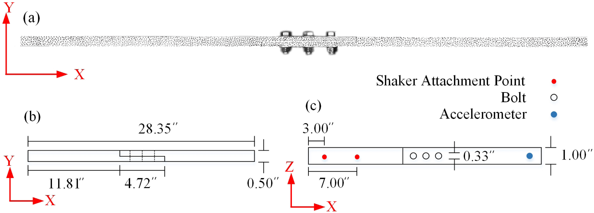
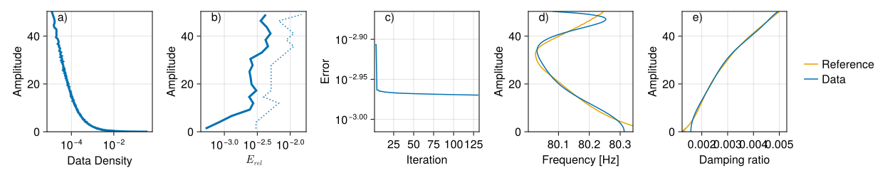
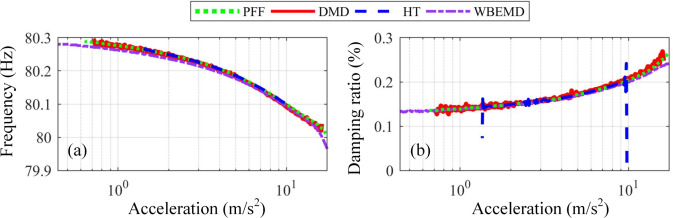
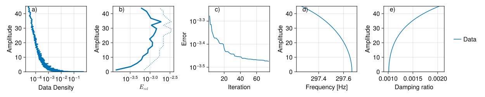
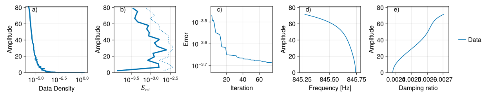

# Brake-Reuss beam

This example is from the [paper](https://doi.org/10.1016/j.ymssp.2021.108401). In particular we are using the resonance decay data, that was generated by driving the system to resonance at the first natural frequency and turning off the forcing. The data is then the decaying trajectory. The data was also analysed in the [paper](https://doi.org/10.1098/rsta.2021.0194).

The [data set](https://github.com/mattiacenedese/BRBtesting) also includes impact hammer tests. As shown in the [paper](https://doi.org/10.1016/j.ymssp.2021.108401) the impact hammer test data gives a significantly different conclusion from that of the resonance decay data, which we show below. [SSMLearn](https://github.com/haller-group/SSMLearn) is unable to analyse this data, because its autoencoder architecture cannot deal with other high-energy vibration modes present in the data.

The schematic the the structure tested is the following:

## Resonance decay

The data was delay embedded using 64 delays, then reduced to 8 dimensions, resolving the highest energy linear modes. There are two invariant foliations calculated the first one corresponding the frequency of the resonant signal has an encoder that fully resolves the phase space, while the second one is locally defined. The first foliation captures an order 11 model and has a quadratic encoder. The second foliation includes the 2nd, 3rd and 4th vibration modes, has a quadratic model and an order 9 encoder.
    
The results are very similar to the reference, which was obtained using a Hilbert transform. There is not testing data, becase we are analysing a single trajectory.

The error of fitting the training trajectory is minimal in the latent space of the model.

## Impact hammer test

This data was not analysed using [SSMLearn](https://github.com/haller-group/SSMLearn), because autoencoders are not capable of separating different vibration modes. Even though the data comes from a different system as already indicated in this [paper](https://doi.org/10.1016/j.ymssp.2021.108401), the backbone curves are different from the resonance decay. This is most likely because high energy impact significantly disturbs the friction joint and the high frequency content of the vibration also alters the friction in the joints throughout the signal decay.

The data was measured by accelerometers at three points.

The analysis of this data in [paper](https://doi.org/10.1016/j.ymssp.2021.108401) was done through linear filtering, which is very different from a nonlinear encoder and therefore we do not expect to give accurate results. For the resonant decay, this was not a major problem, because the high-frequency content has negligible amplitude.

From the impact hammer test data, four invariant foliations were calculated. From the most to least energetic modes
1. at 297.66 Hz, model order 5, encoder order 5
2. at 80.5 Hz, model order 11, encoder order 5
3. at 845.75 Hz, model order 5, encoder order 5
4. at 2765.18 Hz, model order 2, encoder order 9

Our analysis gives the following result for mode 2, which is the same as for the resonance decay data. The error is negligible and the training trajectory mathches the model prediction accurately.

For mode 1, we have similarly accurate results

And for mode 3, we have

    
