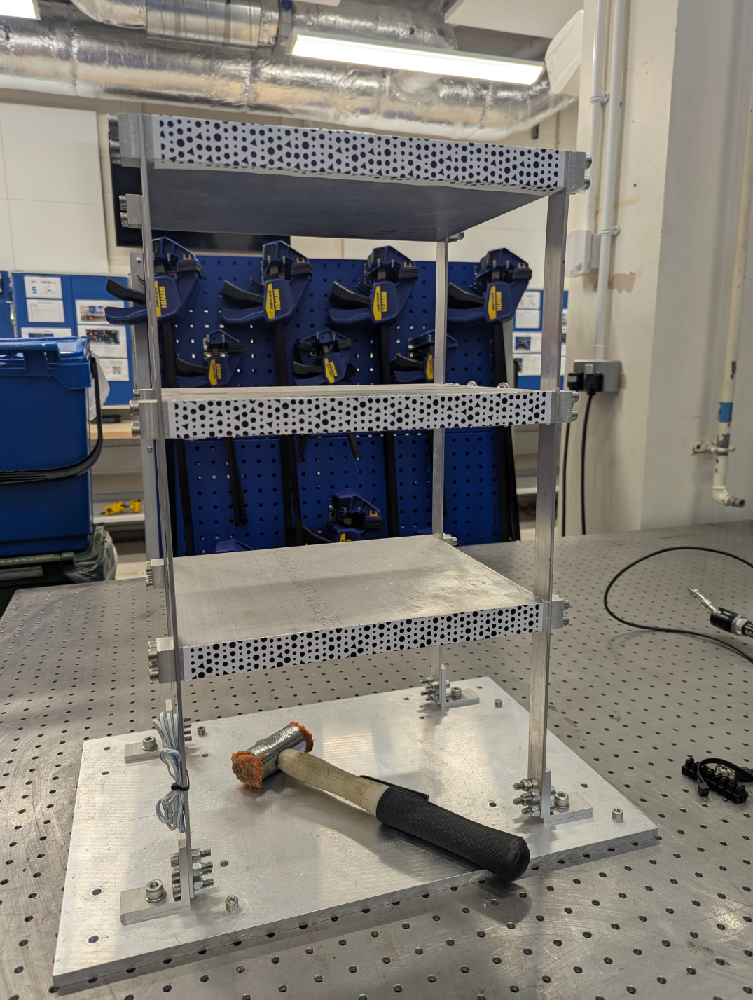
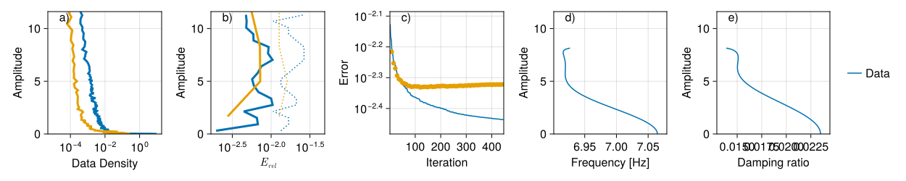
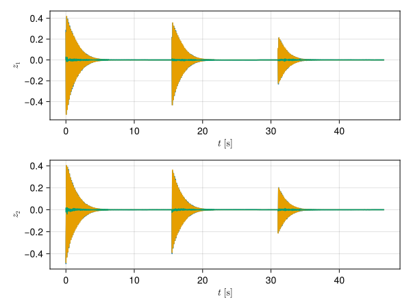
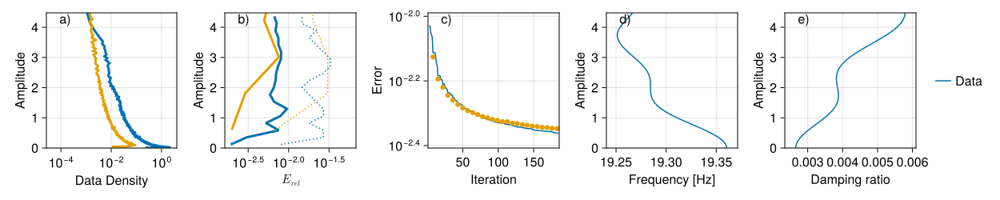
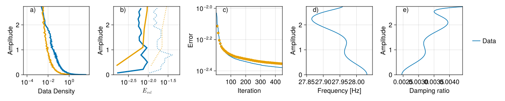
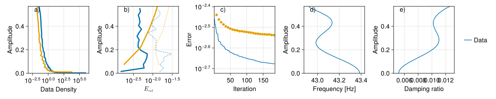

# Vibrations of a building model

The building model consists of three floor made out of solid aluminium that are held together with with four rectangular beams.

Printed patterns were attached to the sides of the floor for motion tracking using digital image correlation.

The experimental data was collected in the Dynamics Lab of the University of Bristol. Two Allied Vision [Alvium 1800 U-052](https://www.alliedvision.com/en/products/alvium-configurator/alvium-1800-u/052/) USB cameras with 8mm lenses were synchronised. One camera captured the top two floors of the structure, the second camera captured the bottom floor. Each floor was hit with a soft hammer three times adding up to nine recorded videos. Six of the videos were used for training and three of the videos were kept for testing. The videos were recorded at 384 fps and the motion then was process into three horizontal displacements signal. Delay embedding of length 32 was used to reconstruct the state space and then the first 10 linear dynamic modes were extracted from the data. Manual inspection reveals that the rest of the dynamic modes consist mainly of noise.

Altogether four two-dimensional invariant foliations could be extracted from the data. For all of them the training trajectories and model predictions match well. It is visible that the slight difference is mostly noise.
    
The nonlinearity of the structure is both geometrical and frictional. As with any friction joints the backbone curves are irregular at high amplitudes, where there is significant relative motion between joining surfaces. In this case the dynamics is surprisingly repeatable, give the accuracy demonstrated on the testing data.
## Mode 1

blue colour represents training data, mustard colour represents testing data.
a) data density as a function of amplitude b) dependence of training and testing errors on vibration amplitude c) progression of training and testing errors throughout the optimisation process. d) instantaneous frequency as predicted by the identified model e) instantaneous damping ratio as predicted by the identified model.

Testing trajectories in the two-dimensional latent space of the invariant foliation. The blue line is the encoded testing data, the mustard line is the model prediction and the green line is the difference between the testing data and the prediction.

## Mode 2

## Mode 3

## Mode 4

## Acknowledgement

The building structure was first used for hybrid testing in the [paper](https://doi.org/10.1098/rspa.2023.0520) by S. Beregi, D. A. W. Barton, D. Rezgui and S. A. Neild. The structure was kindly lent to me by [David Barton](https://www.bristol.ac.uk/people/person/David-Barton-918639cf-46bc-4b95-a1c8-53ad6dbed42c/).

