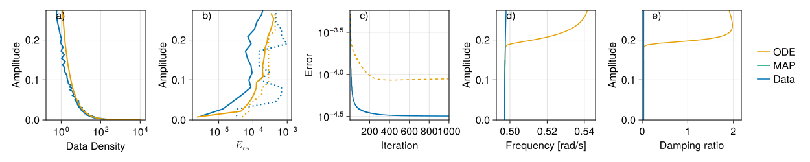
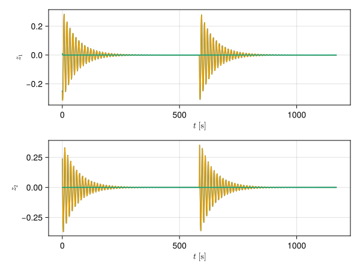
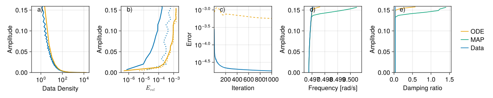
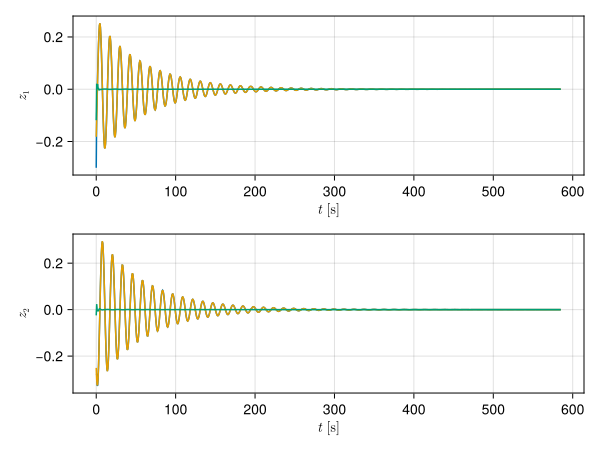

# Car following model

This car following model is taken from the paper [Orosz, G., Wilson, R. E., Szalai, R., and Stépán, G., "Exciting traffic jams: Nonlinear phenomena behind traffic jam formation on highways", Phys. Rev. E 80 (2009), pp. 046205.] and modified to include forcing. A schematic of the model can be seen here:


The equations of motion are
```math
\begin{aligned}
\dot{v}_{k} &=\alpha\left(\frac{V_{k}\left(h_{k}-1\right)^{2}}{1+\left(h_{k}-1\right)^{2}}-v_{k}\right) & k &= 1\ldots n,\\
\dot{h}_{k} &=v_{k-1}-v_{k} & k &= 2\ldots n,\\
h_{1} &= L-\sum_{j=2}^{n}h_{j}. &&
\end{aligned}
```
We assume that the length of the circular track is $L=2n$, the maximum velocity of each vehicle is $V_{k}=1$, except for $V_{n}=1+A\cos\omega t$.

For identifying invariant foliations we use 5 cars, that leads to a 9 dimensional system. The system is tuned near instability by setting $\alpha = 0.75$. Most vibration modes in the system decay quickly. We therefore calculate two invariant foliations. The first one corresponds to the relatively slowly decaying vibration, and the second for the rest of the system. For the first foliation the encoder is quadratic and the conjugate model is a cubic polynomial. For the second foliation the conjugate model is linear and the encoder is cubic, but locally defined, which takes into account that 

## Autonomous system

We use 16 training trajectories and two testing trajectories to identify the invariant foliations. The direct calculation of the invariant manifold from the differential equation shows that the manifold loses normal hyperbolicity at about vibration amplitude $0.15$. The data-driven method does not take notice of the loss of hyperbolicity and continues to follow the invariant manifold.


The comparison of the encoded testing trajectory and the model solution show discrepancy.



## Forced system

To force the system, we use $A=0.1$ forcing amplitude and $\omega=\sqrt{0.4}$ [rad/s] forcing frequency.
The result is much the same, except that natural frequency about the periodic orbit and damping ratio has shifted. Similaly, 16 training and two testing trajectories were used.


In the latent space, at the start of the testing trajectory, there is now a small difference between the model and the testing data.

