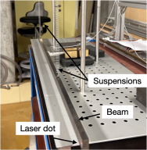
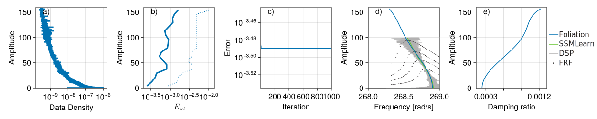

# A titanium beam measuring gravitational interaction

This is a vibration data from a titanium beam that is suspended by to springs on a vibration isilated table:

The original rig is due to [Brack et al.](https://arxiv.org/pdf/2201.03420), but the present data was collected by [Bettini et al.](https://arxiv.org/pdf/2503.21895). The data is not particularly challenging, despite Bettini et al claiming that they needed a custom modification of [SSMLearn](https://github.com/haller-group/SSMLearn). Bettini et al. have also wrongly claimed that invariant foliations would not be able to handle this data. In reality, invariant foliations do work better as we do not need to remove initial transients from the data. Hence the backbone curves are valid for the full length of the trajectory, not just at lower amplitudes.

To analyse the data we use delay embedding of length 64, from which three vibration modes are captured. We use two invariant foliations to fit to the data, the first corresponds to the dominant vibration, the two others are low amplitude modes that could not be eliminated entirely by the exprimental technique of starting the decay at a forced resonance peak. The first foliation has a model of order 7 and a linear encoder, the second foliation (which is 4 dimensional) has a linear model and order 7 locally defined encoder. This choice prevents overfitting.
    
The comparison between our result and that of Bettini et al. can be seen below.

We are able to recover higher amplitude vibrations. It is also clear that the calculation converges quickly and only a few iterations are necessary to arrive at an accurate model. 

The model can also easily and accurately reproduce the vibration in the latent space as shown here:

