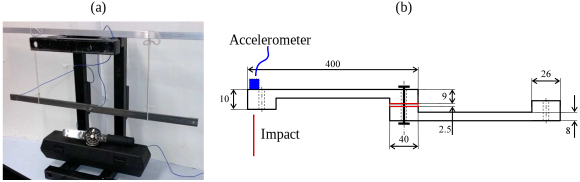
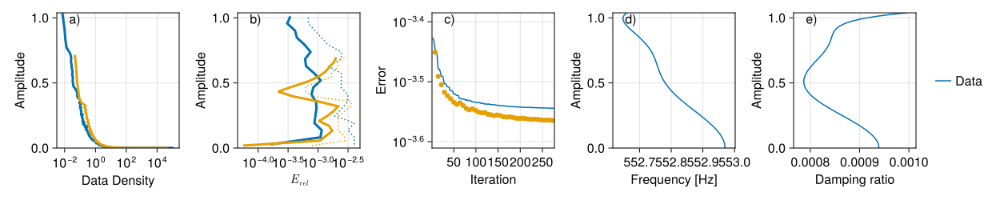
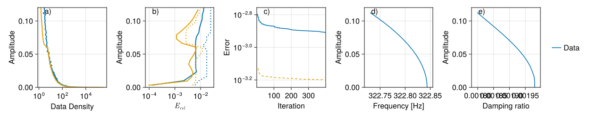
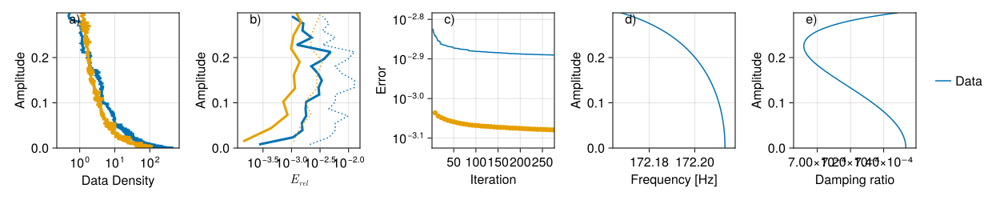
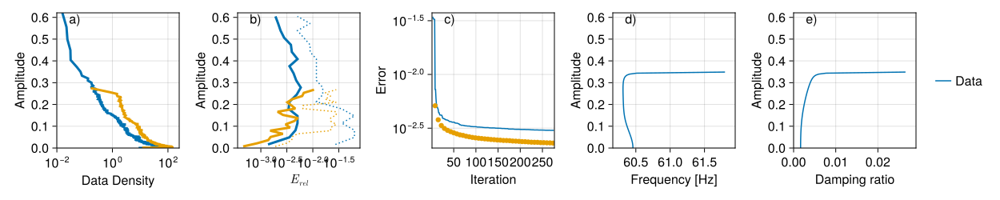
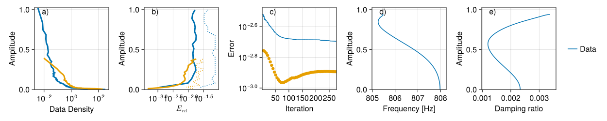
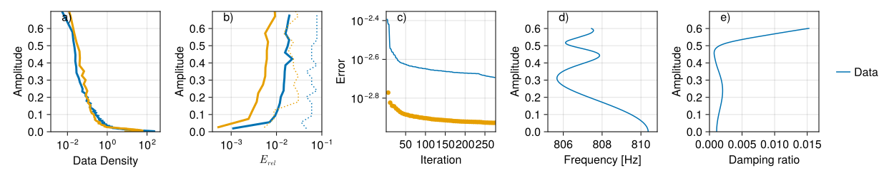

# Vibrations of a jointed beam

The schematic of the rig is

The experimental data was collected by [B. Titurus](https://research-information.bris.ac.uk/en/publications/d09a7635-eda6-44db-96c0-aba6a7225d10). The joint in the beam was fastened with various torques and an impact was applied to to beam. Here we use the data with 1.0 [Nm] fastening torque. The resulting vibration was recorded through an accelerometer at sampling frequency 2048 [kHz].

We used the first 8 recorded trajectories. Trajectories 1, 3, 5, 6, 8 form the training data and trajectories 2, 4 form the testing data.

The scalar valued data was delay embedded using 18 sample long delays. The first 12 highest energy dynamic modes were then extracted and used to fit 6 invariant foliations. The first 4 foliations have models and encoders of order 5, the last two foliations are cubic both in the model and the encoder.

In what follows we display the results in the order of decreasing energy content. Note that the lowest frequency does not have the highest energy content. With the current (not tuned) choice of hyper parameters modes 5 and 6 have low accuracy, which is to be expected do to their low energy content.

## Mode 1

## Mode 2

## Mode 3

## Mode 4

## Mode 5

## Mode 6

