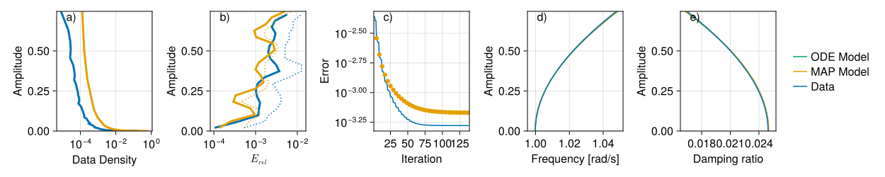
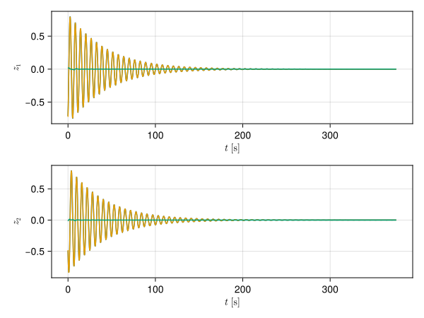
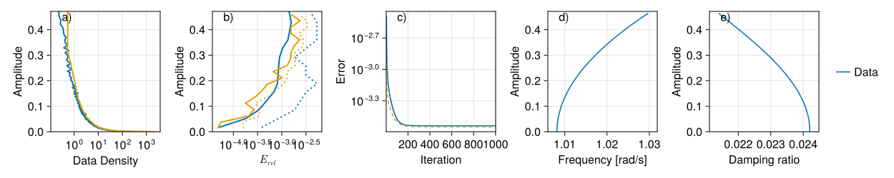
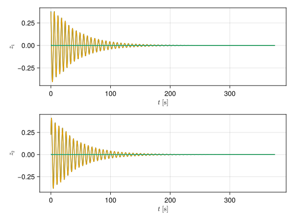
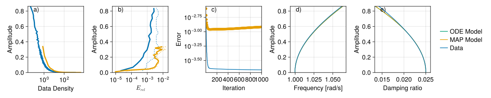

# Shaw-Pierre system

This is a two degrees-of-freedom mechanical system with a nonlinear spring and damper. The nonlinearity only affects the first mass directly.

The system has a long history, but the current version is taken from [Bettini et al.](https://arxiv.org/abs/2503.21895), where the authors transform the system into the new coordinates
$$
\boldsymbol{y}=\begin{pmatrix}y_1\\y_2\\y_3\\y_4 \end{pmatrix}:=
\begin{pmatrix}\dot{x}_1\\\dot{x}_2-\dot{x}_1\\x_1\\x_2 - x_1 \end{pmatrix},
$$
so that the eigenvectors of the Jacobian are not close to being orthogonal. The fully transformed system is given by
$$
\dot{\boldsymbol{y}}=\begin{pmatrix}0 & 0 & 1 & 0\\ 0 & 0 & 0 & 1\\ -k_{1} & k_{2} & -c_{1} & c_{2}\\ 0 & -\left(k_{1}+2 k_{2}\right) & 0 & -\left(c_{1}+2 c_{2}\right) \end{pmatrix}\boldsymbol{y}+\begin{pmatrix}0\\ 0\\ -\alpha y_{1}^{3}+\alpha c_{1}y_{3}^{3}+\beta\cos(\omega(t+0.1))\\ \beta\cos t \end{pmatrix},
$$
where the parameter values are
$$
k_{1}=1,\;k_{2}=3.325,\;c_{1}=0.05,\;c_{2}=0.01,\;\alpha=0.5.
$$
In our modification we have added forcing and nonlinear damping, otherwise it is too trivial. The forcing amplitude is $\beta$.

The system has two vibration modes. The first mode has $\omega_1\approx1$ [rad/unit time], the second mode has $\omega_2\approx 2.765$ [rad/unit time].

Note that the invariant foliation for the second mode is linear both in the encoder and in the conjugate dynamics. This also means that the invariant manifold for the first mode is linear. However, the invariant foliation for the first mode is fully nonlinear, and this is what we identify.

## Autonomous system

For the autonomous system, we set the forcing amplitude to $\beta=0$. We use 5 training trajectories and one testing trajectory to check how the identified model generalises to unseen data. Each trajectory is 1350 samples long and time inerval between two consecutive samples is set to $\Delta t= 0.278$ [unit time]. The initial conditions are sampled from a uniform distribution on the surface of the 4 dimensional unit sphere of radius $0.6$.

The result shows that the testing error is similar to the training error and does not increase throughout the training process. Hence the foliation generalises to unseen data.

The following figure shows that there is very little difference between the encoded testing trajectory and the model prediction. The blue line is the encoded testing trajectory, the mustard line is the model prediction and the green line is the difference between the two.

## Forced system

The forcing parameter is set to $\beta = 0.04$, which is resolved using a 19 point Fourier collocation scheme. This time 16 training trajectories are used and one testing trajectory. The sampling frequency remains the same. With this amount of training data the foliation generalises very well and the testing error closely follows the training error. The damping ratio now turns into a softening then hardening shape.

The error between the model prediction and the testing data is negligible as can be seen below.

## Parameter dependent system

We are now looking into generating a system, where a parameter value for each  training/testing trajectory differs. Here we use a five node Chebyshev grid on the $\alpha \in [0.4, 0.6]$ interval. We create 16 training trajectories with parameter values that on the 16 node Chebyshev grid on the interval [0.4, 0.6]. The single testing trajectory is produced at $\alpha = 0.48988$, which is not in the training set. The calculated parameter dependent invariant foliation generalises less than in the previous two instance, but the accuracy is still acceptable.

The error between the model prediction and the testing data is now noticeable at higher amplitudes.

