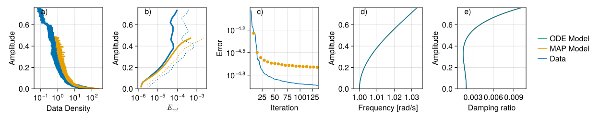
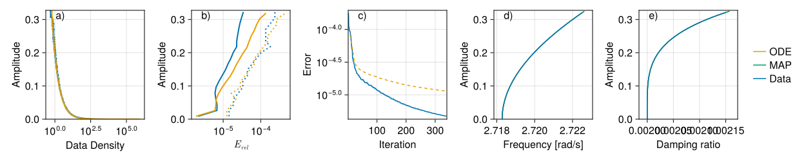
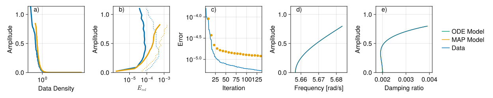
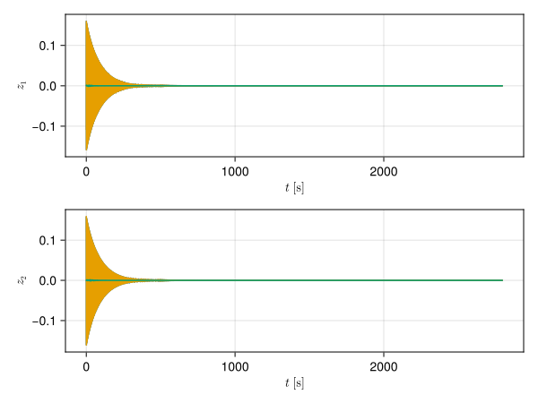
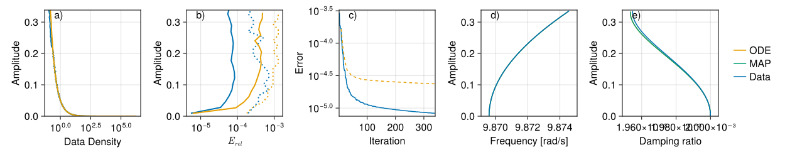
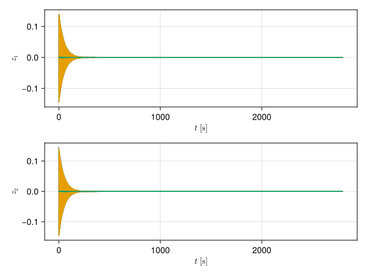
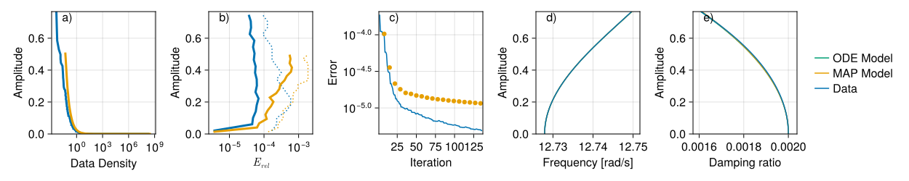
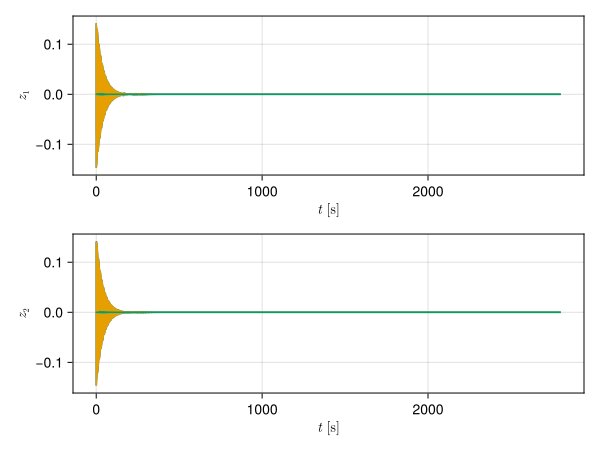

# Ten-dimensional system

This system was first introduced in the [paper](https://doi.org/10.1007/s00332-023-09932-y) to test data-driven calculation of invariant foliations. The current software improves the accuracy of this identification considerably. The system is artificial, made up of non-linearly coupling five nonlinear oscillators. This exaggerates the effect of multiple co-existing nonlinear vibration modes that is impossible to disentagle using [SSMLearn](https://github.com/haller-group/SSMLearn).

The system of decoupled oscillators is denoted by $\dot{\boldsymbol{x}}=\boldsymbol{f}_{0}\left(\boldsymbol{x}\right)$, where the state variable is in the form of 
$$
\boldsymbol{x}=\left(r_{1},\ldots,r_{5},\theta_{1},\ldots,\theta_{5}\right)
$$
and the dynamics is given in polar coordinates by 
$$
\begin{array}{ll}
\dot{r}_{1}=-\frac{1}{500}r_{1}+\frac{1}{100}r_{1}^{3}-\frac{1}{10}r_{1}^{5}, & \dot{\theta}_{1}=1+\frac{1}{4}r_{1}^{2}-\frac{3}{10}r_{1}^{4},\\
\dot{r}_{2}=-\frac{\mathrm{e}}{500}r_{2}-\frac{1}{10}r_{2}^{5}, & \dot{\theta}_{2}=\mathrm{e}+\frac{3}{20}r_{2}^{2}-\frac{1}{5}r_{2}^{4},\\
\dot{r}_{3}=-\frac{1}{50}\sqrt{\frac{3}{10}}r_{3}+\frac{1}{100}r_{3}^{3}-\frac{1}{10}r_{3}^{5},\quad & \dot{\theta}_{3}=\sqrt{30}+\frac{9}{50}r_{3}^{2}-\frac{19}{100}r_{3}^{4},\\
\dot{r}_{4}=-\frac{1}{500}\pi^{2}r_{4}+\frac{1}{100}r_{4}^{3}-\frac{1}{10}r_{4}^{5}, & \dot{\theta}_{4}=\pi^{2}+\frac{4}{25}r_{4}^{2}-\frac{17}{100}r_{4}^{4},\\
\dot{r}_{5}=-\frac{13}{500}r_{5}+\frac{1}{100}r_{5}^{3}, & \dot{\theta}_{5}=13+\frac{4}{25}r_{5}^{2}-\frac{9}{50}r_{5}^{4}.
\end{array}\label{eq:10dim-model}
$$
The first transformation brings the polar form of equation into Cartesian coordinates using the transformation $\boldsymbol{y}=\boldsymbol{g}\left(\boldsymbol{x}\right)$, which is defined by $y_{2k-1}=r_{k}\cos\theta_{k}$ and $y_{2k}=r_{k}\sin\theta_{k}$. Finally, we couple all variables using the second nonlinear transformation
$\boldsymbol{y}=\boldsymbol{h}\left(\boldsymbol{z}\right)$, which reads 
$$
\begin{array}{rlrl}
y_{1} & =z_{1}+z_{3}-\frac{1}{12}z_{3}z_{5}, & y_{2} & =z_{2}-z_{3},\\
y_{3} & =z_{3}+z_{5}-\frac{1}{12}z_{5}z_{7}, & y_{4} & =z_{4}-z_{5},\\
y_{5} & =z_{5}+z_{7}+\frac{1}{12}z_{7}z_{9}, & y_{6} & =z_{6}-z_{7},\\
y_{7} & =z_{7}+z_{9}-\frac{1}{12}z_{1}z_{9}, & y_{8} & =z_{8}-z_{9},\\
y_{9} & =z_{9}+z_{1}-\frac{1}{12}z_{3}z_{1},\quad & y_{10} & =z_{10}-z_{1},
\end{array}\label{eq:10dim-transform}
$$
and where $\boldsymbol{y}=\left(y_{1},\ldots,y_{10}\right)$ and $\boldsymbol{z}=\left(z_{1},\ldots,z_{10}\right)$. The two transformations give us the differential equation $\dot{\boldsymbol{z}}=\boldsymbol{f}\left(\boldsymbol{z}\right)$, where
$$
\boldsymbol{f}\left(\boldsymbol{z}\right)=\left[D\boldsymbol{g}^{-1}\left(\boldsymbol{h}\left(\boldsymbol{z}\right)\right)D\boldsymbol{h}\left(\boldsymbol{z}\right)\right]^{-1}\boldsymbol{f}_{0}\left(\boldsymbol{g}^{-1}\left(\boldsymbol{h}\left(\boldsymbol{z}\right)\right)\right).\label{eq:10dim-finmod}
$$
The natural frequencies of our system at the origin are
$$
\omega_{1}=1,\omega_{2}=\mathrm{e},\omega_{3}=\sqrt{30},\omega_{4}=\pi^{2},\omega_{5}=13
$$
and the damping ratios are the same $\zeta_{1}=\cdots=\zeta_{5}=1/500$.

In this example we use five (5) training trajectories and one testing trajectory. The initial conditions were drawn from a uniform distribution from the surface of the $0.6$ radius ball in 10 dimensions.

For all modes the accuracy is similar. The difference between the direct calculation of invariant manifolds and the results of the data-driven method is not noticeable.

## Mode 1

## Mode 2

## Mode 3

## Mode 4

## Mode 5

